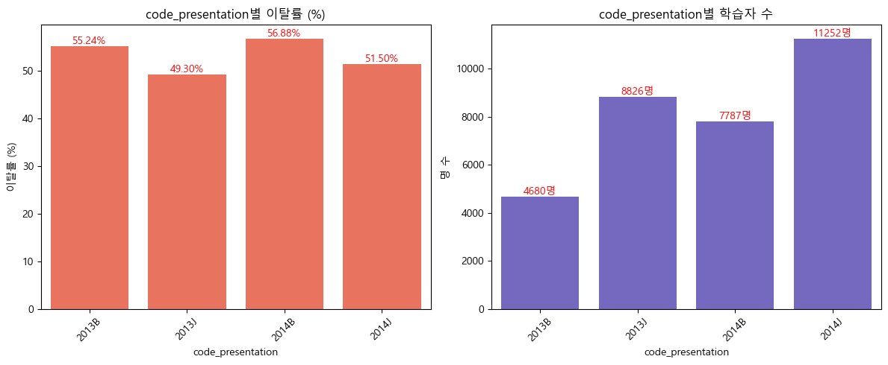

# SKN13-2nd-3Team

---

# 0. 팀 소개

---

## 🙋🏻 팀명: 묵(Mooc)찌²빠 ✊🏻👉🏻👈🏻🤚🏻

| || | |
|:---------------------:|:------------------:|:------------------:|:------------------------:|
| 강지윤 | 김지민 | 지형우 | 구재회 |
| [@jiyun-kang12](https://github.com/jiyun-kang12)  | [@Gogimin](https://github.com/Gogimin) | [@JI0617](https://github.com/JI0617) | [@jaehoi-koo](https://github.com/jaehoi-koo) |


# 1. 프로젝트 개요

---

## >💻MOOC 온라인 학습 플랫폼 이탈률 예측

MOOC (Massive Open Online Course)는 인터넷을 통해 누구나 자유롭게 수강할 수 있는 **대규모 공개 온라인 강좌**를 뜻함.  접근성과 편의성이 높다는 점에서 MOOC에 대한 긍정적인 측면도 존재하지만, 온라인 특성이 가진 여러 한계점으로 인해, 학습자의 이탈률 또한 높은 편에 속함(Goopio & Cheung, 2020)

(참고: Goopio, J., & Cheung, C. (2020). The MOOC dropout phenomenon and retention strategies. *Journal of Teaching in Travel & Tourism*, *21*(2), 177–197. https://doi.org/10.1080/15313220.2020.1809050)

**MOOC 온라인 학습자 이탈률이 높은 이유**

**✅ 1. 자기주도학습 기반의 구조적 한계**

| 원인 | 설명 |
| --- | --- |
| ❗ 낮은 학습 몰입도 | MOOC는 대부분 무료로 제공되며, 외부 압박이나 평가가 없어 **책임감과 몰입도가 낮음** |
| ❗ 비동기 학습의 단절감 | 동료 학습자 및 강사와의 상호작용 부족 → **고립감과 동기 저하** |
| ❗ 과도한 콘텐츠 분량 | 강의 길이, 분량이 부담스러워 학습 지속에 어려움 |
| ❗ 목표 설정의 모호성 | 학습자들이 구체적인 목표 없이 수강을 시작해 **중도 포기 확률 증가** |

✅ 2. **학습자 개인 요인**

| 요인 | 설명 |
| --- | --- |
| 🔍 시간 부족 | 직장인/성인 학습자가 많아 **학습 시간 확보 어려움** |
| 🔍 디지털 학습 역량 부족 | 일부 학습자는 온라인 플랫폼에 익숙하지 않아 **초기 적응 실패** |
| 🔍 낮은 동기 | 무료이거나 인증 필요성이 낮아 **실제 수료 동기가 부족** |
| 🔍 학업 능력 차이 | 기본 지식 부족, 자기조절 학습 전략 미흡 → **초반 이탈** |

---

### 🎯  **프로젝트 목표**

- **MOOC 학습자 이탈(dropout) 행동을 조기에 예측**하여, 교수설계자가 학습자 유지(retention) 전략을 설계할 수 있도록 지원
- 학습자의 **인구통계 정보**, **학업 이력**, **온라인 학습 활동 데이터** 등을 바탕으로, 이탈 가능성이 높은 학습자를 사전에 식별

### **프로젝트 기획**

**최적 성능 예측 모델 구축 (데이터 전처리-모델 파라미터 조정- 모델 최종 평가)**


**Streamlit 화면 구현** 

- **#1 대시보드 홈** :  프로젝트 소개 및 데이터 셋 소개
- **#2 학습자 정보 입력:** 새로운 데이터 입력을 위한 정보 입력 화면
- **#3 예측 결과**: 입력된 데이터에 따른 이탈률 및 정보 결과
- **#4 각 모델별 성능 평가 결과:** 사용한 모델에 대한 성능 결과(Accuracy, Precision, Recall, ROC Curve 등)


**📊 데이터 수집 및 선정**

1. **데이터 개요**

**: Open University Learing Analytics Dataset(OULAD)**

OULAD는 영국의 Open University에서 제공하는 학습 분석 데이터셋으로, 학습자의 행동(Behavior) 및 학습 성과(Learning assessment)을 포함하고 있습니다.  본 데이터셋은 온라인 학습 환경에서의 학습 패턴 분석, 학습자 이탈 예측, 맞춤형 학습 지원 시스템 개발 등의 연구에 폭넓게 활용되고 있습니다.


✅ 출처: [👨‍🎓 Open University Learning Analytics](https://www.kaggle.com/datasets/mexwell/open-university-learning-analytics)


>❓**Open University란?**<br>
>Open University는 1969년에  영국에서 설립된 세계적인 **원격 교육 전문** 공립 대학으로, 온라인 강의, 교재, 튜터링을 통해 전 세계 학습자에게 교육 과정을 제공하고 있습니다.<br>
> 특히, Open University는 2013년 자사의 **MOOC 플랫폼인 FutureLearn**을 설립해, 다양한 대학 및 기관과 협력하여 누구나 무료로 수강할 수 있는 온라인 강좌를 제공하고 있습니다. 


1. **최종 선정된 데이터셋 구성**
- 🧑🏻‍🎓학습자 기본 정보(StudentInfo): 학습자의 인구통계학적 정보, 교육 수준 및 수강 정보 (target값이 포함된 테이블)
- ✏️학습자 수강 등록 정보(studentRegistration) : 학습자가 수강을 신청하고 취소한 날짜에 관한 정보
- 💯 과제 수행 성과(studentAssessment) : 수강 기간 동안 수행한 시험 혹은 과제의 점수
- 🖱️학습 행동 데이터(studentVle) : 온라인 학습 환경(VLE)에서 학습자의 총 클릭 수

**ERD**


| **변수명** | **변수 설명** | **변수 타입** |
| --- | --- | --- |
| `id_student` | 학습자의 고유 식별 번호 | **수치형 (Key)** |
| `code_module` | 학습자가 수강한 과목의 식별 코드  | **범주형** |
| `code_presentation` | 학습자가 해당 모듈을 수강한 프레젠테이션(Presentation, 강의 회차)의 식별 코드 | **범주형** |
| `gender` | 학습자의 성별  | **범주형** |
| `region` | 해당 모듈을 수강할 당시 학습자가 거주한 지역 | **범주형** |
| `highest_education` | 해당 모듈 수강 시점에서 학습자가 보유한 최고 학력 수준 | **범주형** |
| `imd_band` | 학습자가 거주한 지역의 복합 빈곤 지수(Index of Multiple Deprivation, IMD) 구간 | **범주형** |
| `age_band` | 학습자의 연령대 | **범주형** |
| `num_of_prev_attempts` | 해당 모듈을 학습자가 이전에 시도한 횟수 | **수치형** |
| `studied_credits` | 학습자가 현재 수강 중인 모듈들의 총 학점 수 | **수치형** |
| `disability` | 학습자가 시스템 장애를 신고했는지 여부 | **범주형** |
| `date_registration` | 학습자가 해당 모듈-프레젠테이션에 등록한 날짜 ; 모듈 시작일 기준으로 측정된 일수 (예: -30은 시작 30일 전에 등록했음을 의미)  | **수치형** |
| `date_unregistration` | 학습자가 해당 모듈-프레젠테이션에서 등록을 취소한 날짜 (모듈 시작일 기준으로 측정됨) | **수치형** |
| `sum_click` | 해당 날짜에 학습자가 해당 자료와 상호작용한 총 클릭 수 (이용 횟수) | **수치형** |
| `avg_score` | score : 해당 평가에서 학습자가 받은 점수의 평균 (0점에서 100점 사이) ; **40점 미만은 Fail(낙제)**로 간주됨 | **수치형** |
| `final_result` (target) | 해당 모듈-프레젠테이션에서의 학습자의 최종 결과(Pass, Faill, Withdrawn, Distinction) | **범주형** |

# 2. 탐색적 데이터 분석(EDA)

---

### 1. 데이터 전처리🧹

1️⃣ **이상치 처리**

모델 학습의 정확성을 높이기 위해 데이터 전처리 과정에서 두 가지 조건에 해당하는 이상치 제거함.
1) 학습 결과가 'Fail'인 경우 수강을 취소한 것이 아닌 데이터임에도 불구하고 수강 취소일(`date_unregistration)` 에 존재함. → 성적과 수강 상태 간 불일치로 간주하여 제거.
2) 수강 등록일(`date_registration`)이 결측치(데이터 없음)이면서 최종 결과(`final_result`)가 'Withdrawn'인 경우는 등록 정보가 없는 탈락 케이스로 판단하여 제거

```python
# 조건: final_result가 Fail이고, date_unregistration이 null이 아님
condition1 = (merged_df["final_result"] == "Fail") & (merged_df["date_unregistration"].notnull())

# 해당 조건을 만족하는 행 제거
merged_df = merged_df[~condition1]

# 조건 정의: date_registration이 NaN이고 final_result가 Withdrawn인 경우
condition = (merged_df["date_registration"].isna()) & (merged_df["final_result"] == "Withdrawn")

# 해당 조건에 맞는 행 제거
merged_df = merged_df[~condition]
```

**수치형 컬럼 이상치 확인**<br> 

**2️⃣ 결측치 처리**

결측값이 존재하는 컬럼에 대해 다음과 같은 방식으로 처리함.

- `date_unregistration`: 수강 취소 여부만 나타내는 컬럼이므로, 결측값은 **취소되지 않음**을 의미하는 `9999`로 대체
    
>💡**`9999` 로 대체한 이유** <br>
> 본 컬럼은 일정한 기간(ex. 30일)에 관한 데이터이므로, 수강이 아예 취소되지 않음을 표현하기 위해 어떤 날짜 데이터에서도 나올 수 없는 “의미없는 큰 값”인 `9999`을 사용
    
- `imd_band` (지역 사회 경제 지수): 범주형 변수로 **최빈값**으로 대체
- `date_registration`: 수치형 변수로 **평균값**으로 대체

→ 아래 두 가지 처리는 `ColumnTransformer`와 `SimpleImputer`를 활용해 일괄적으로 적용

**3️⃣ 범주형 변수 인코딩**

모델 학습을 위해 주요 범주형 컬럼들을 수치형으로 직접 인코딩.

- `highest_education`: 교육 수준을 범주형으로 간주하여 서열화 인코딩 적용
    
    (`No Formal Quals` → 0, ..., `Post Graduate Qualification` → 4)
    
- `age_band`: 연령 구간을 대표값(중앙값)으로 대체 (예: `35-55` → 45)
- `imd_band`: 사회 경제적 취약 정도를 1~10으로 서열화하여 수치로 변환

→ 모든 문자열 값은 사전에 `.str.strip().str.title()`을 통해 정제 후 인코딩을 수행 (자세한 인코딩 값은 코드 참고)

```python
# 1) highest_education 학력별로 부여
education_order = {
    "No Formal Quals": 0,
    "Lower Than A Level": 1,
    "A Level Or Equivalent": 2,
    "He Qualification": 3,
    "Post Graduate Qualification": 4}

#2) age_band 중간 값으로 변경
age_map = {
    "0-35": 30,    
    "35-55": 45,
    "55<=": 60}      # 55세 이상이므로 60 또는 65로 추정

# 3) 취약계층 서열화 
imd_order = {
    "0-10%": 1,
    "10-20": 2,
    "20-30%": 3,
    "30-40%": 4,
    "40-50%": 5,
    "50-60%": 6,
    "60-70%": 7,
    "70-80%": 8,
    "80-90%": 9,
    "90-100%": 10}
```

4️⃣ **Feature Engineering**

- 범주형 변수: `OneHotEncoder`를 통한 원-핫 인코딩
- 연속형 수치 변수:  `StandardScaler`를 적용하여 정규화 처리

→ 최종 전처리 파이프라인은 `ColumnTransformer`를 활용해 구성하였으며, 이를 통해 학습 입력에 사용할 전처리된 특성 행렬을 생성

5️⃣ **Target 변수 생성**

이탈 예측을 위한 타겟 변수(`target`)는 `final_result`를 기반으로 다음과 같이 이진 분류값으로 변환

| final_result 값 | 설명 | 이탈 여부 | target 값 |
| --- | --- | --- | --- |
| **`“Pass”`** | 학습자가 모듈을 수료하고 **합격 기준을 충족**하여 정상적으로 완료한 경우 | 이탈 ❌  | `0` |
| **`“Distinction”`** | 매우 우수한 성적으로 모듈을 **우등 졸업(Distinction)**한 경우 | 이탈 ❌ | `0` |
| **`“Fail”`** | 수료는 하였으나 **학업 성과가 미달되어 낙제한 경우** | 이탈 ⭕ | `1` |
| **`“Withdrawn”`** | 학기 중 **중도에 수강을 철회하거나 학업을 중단한 경우** | 이탈 ⭕ | `1` |

→ 변환 후 `final_result` 컬럼은 제거하여 학습 데이터에 포함되지 않도록 함.

>💡**Fail 을 이탈(target =1)로 간주한 근거**  <br>
>온라인 학습 환경에서의 학습자 이탈은 단순한 **중도 포기(Withdrawn)** 뿐만 아니라, **학습 목표 미달로 인해 학업을 완료하지 못한 경우**까지 포함하여 정의될 수 있음(Kloft et al., 2014). <br>
> 즉, **최종 성과가 Fail로 기록된 학습자**는 공식적으로 수료 과정을 마쳤다고 할 수는 있으나, **학업적 성취를 이루지 못하고 프로그램의 목적을 달성하지 못한 상태**이므로, 이는 실질적인 학업적 이탈로 간주<br>
> Kloft, M., Stiehler, F., Zheng, Z., & Pinkwart, N. (2014). Predicting MOOC dropout over weeks using machine learning methods. In *Proceedings of the EMNLP 2014 workshop on analysis of large scale social interaction in MOOCs* (pp. 60-65).


### 2. 데이터 시각화

**2-1. 컬럼별 이탈자에 대한 비율 및 전체비율 시각화 결과**


**2-2. 히트맵 시각화를 통한 컬럼별 상관관계** 


**2-3. 컬럼별 학습자 이탈률 및 학습자 분포 시각화**

**✔️수강 과목(Code Module)별 이탈률**

과목별 이탈률을 비교한 결과, CCC(62.1%)로 가장 높지만, 학습자 수를 비교해보면 두번째로 이탈률이 높은 과목인 DDD(58.29%)로 실제 이탈자의 수는 DDD과목이 더 높다는 것을 알 수 있음


**✔️수강 강의 회차(Code Presentation)별 이탈률**

두개의 년도를 비교해보면 1학기(=B) 이탈률이 2학기(=J) 이탈률보다 높은 것으로 나타났음. 반면, 실제 강의를 듣는 학습자 수는 하반기(=J)에 더 많은 것으로 보이며, **실제적으로 하반기 학습자들이 강의도 많이 수강하면서 이탈률은 상반기에 비해 낮은 것으로 나타남.**



**✔️최종 학력 수준(Highest Education)별 이탈률**

최종 학력 수준별 이탈률은 수준이 낮을수록 이탈률이 높아지는 경향을 보이지만, 실제 학습자 수로 비교하였을 때 1(=Lower Than A Level)수준은 중등 교육 이하의 교육 수준을 가진 학습자들이 가장 많이 수강하지만, 이탈률은 61.09%로 실제 학습자 수 대비 가장 많은 것으로 나타남.


**✔️학습자가 거주한 지역의 복합 빈곤 지수별 이탈률**

지역 복합 빈곤 지수별 이탈률을 비교한 결과, 빈곤 지수가 낮을수록 이탈률은 높아지는 경향을 보이는 것으로 나타남. 한편, 3수준(53.37%)에 해당되는 학습자 수(4759명)가 가장 많기 때문에, 실제 이탈률 수는 1수준과 2수준과 거의 비슷한 수준인 것을 알 수 있음.


**✔️연령대별 이탈률**

연령대별 이탈률을 비교한 결과, 낮은 연령층에 속한 학습자들이 이탈률도 가장 높으며, 실제 학습자 수와도 비례하는 것을 알 수 있음. 결론적으로, 낮은 연령층에 속한 학습자들이 실제 학습자수 대비 가장 큰 이탈률을 보임.


